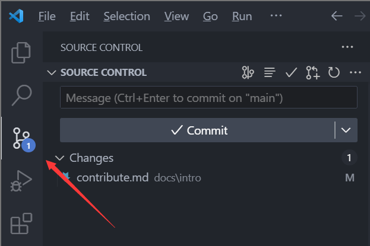

# 贡献方法

!!! warning

    建设中

## 软件

你可能需要以下软件，除 git 外不是必须的，但它们很有用，可以简化下面的步骤，减少学习成本，尤其是 git 命令们。

- [Git](https://git-scm.com/downloads)
- [Visual Studio Code](https://code.visualstudio.com/)
- [Python](https://www.python.org/downloads/)
- [GitHub Desktop](https://desktop.github.com/)

## 步骤

### TL;DR

为 [LeSnow-Ye/wx-wiki](https://github.com/LeSnow-Ye/wx-wiki) 提交 pr。

### 具体步骤

贡献本项目需要简单的 git 知识，但这并不难，跟随以下步骤操作即可。也可以阅读 [Git](#git) 部分以了解更多。

=== "第一次贡献"

    如果你是第一次进行贡献，则需要对 [LeSnow-Ye/wx-wiki](https://github.com/LeSnow-Ye/wx-wiki) 进行 fork：

    1. 创建 GitHub 账号，假设你叫作 xxx
    2. 点击 [LeSnow-Ye/wx-wiki](https://github.com/LeSnow-Ye/wx-wiki) 上的 fork 按钮，你会得到一个名为 `xxx/wx-wiki` 的 repo
    3. 在本地 `git clone https://github.com/xxx/wx-wiki.git`

=== "第 N 次贡献"

    如果不是第一次进行贡献，可能需要对上游仓库 [LeSnow-Ye/wx-wiki](https://github.com/LeSnow-Ye/wx-wiki) 进行同步：

    1. 添加 [LeSnow-Ye/wx-wiki](https://github.com/LeSnow-Ye/wx-wiki) 作为远程仓库：

        ```bash
        git remote add upstream https://github.com/LeSnow-Ye/wx-wiki.git
        ```

    2. 拉取上游仓库的更改：

        ```bash
        git fetch upstream
        ```

    3. 合并上游仓库的更改：

        === "merge"

            ```bash
            git merge upstream/main
            ```

        === "rebase"

            ```bash
            git rebase upstream/main
            ```

        `merge` 与 `rebase` 的区别参见 [Git](#git)。

    4. 推送更新到你的 fork：

        由于同步是在本地运行的，你可能还需要 push 回远程仓库 `xxx/wx-wiki`

        ```bash
        git push origin main
        ```

完成上述过程后，你可以开始正式地编写内容：

1. 编辑 /docs/\*/*.md
2. 编辑 mkdocs.yml 中的 nav 部分
3. [可选] 使用 `mkdocs serve` 在本地调试，参考 [本地测试](#_5)
4. 编辑完成之后，使用 `git add .` 来将所有的文件暂存，以准备 commit (提交)
5. 使用 `git commit` 命令提交这些更改，你需要对提交的内容进行简要描述。
6. 使用 `git push` 命令将你的本地分支推送到你的 GitHub Fork `xxx/wx-wiki`
7. 访问 <https://github.com/xxx/wx-wiki>，点击 “New Pull Request” 按钮，创建一个 PR (Pull Request)
8. 等待 PR 被合并到主分支，之后将可以在 <https://wx.lesnow.top> 上看到更改

事实上一些软件可以减少甚至完全取缔手动输入 git 命令，比如 [Visual Studio Code](https://code.visualstudio.com/) 或者 [GitHub Desktop](https://desktop.github.com/)



### Git

Git 是一个分布式版本控制系统，它允许多人协同开发并跟踪文件的更改。

!!! warning

    TODO

### 本地测试

由于在 merge 前，你并不知道你的 md 文件的最终在网页上的呈现效果，你可以在本地搭建一个测试环境：

1. 在根目录运行命令 `pip install -r requirements.txt` 以安装所需的包（需要 Python 以及 pip，默认安装 Python 会同时安装 pip。只需要运行一次）
2. 运行 `mkdocs serve`（vscode 中可以按 `Ctrl + Shift + ~` 打开终端）
3. 在浏览器访问 <http://127.0.0.1:8000/> 以观察渲染效果

参考 [Creating your site - Material for MkDocs](https://squidfunk.github.io/mkdocs-material/creating-your-site/)
